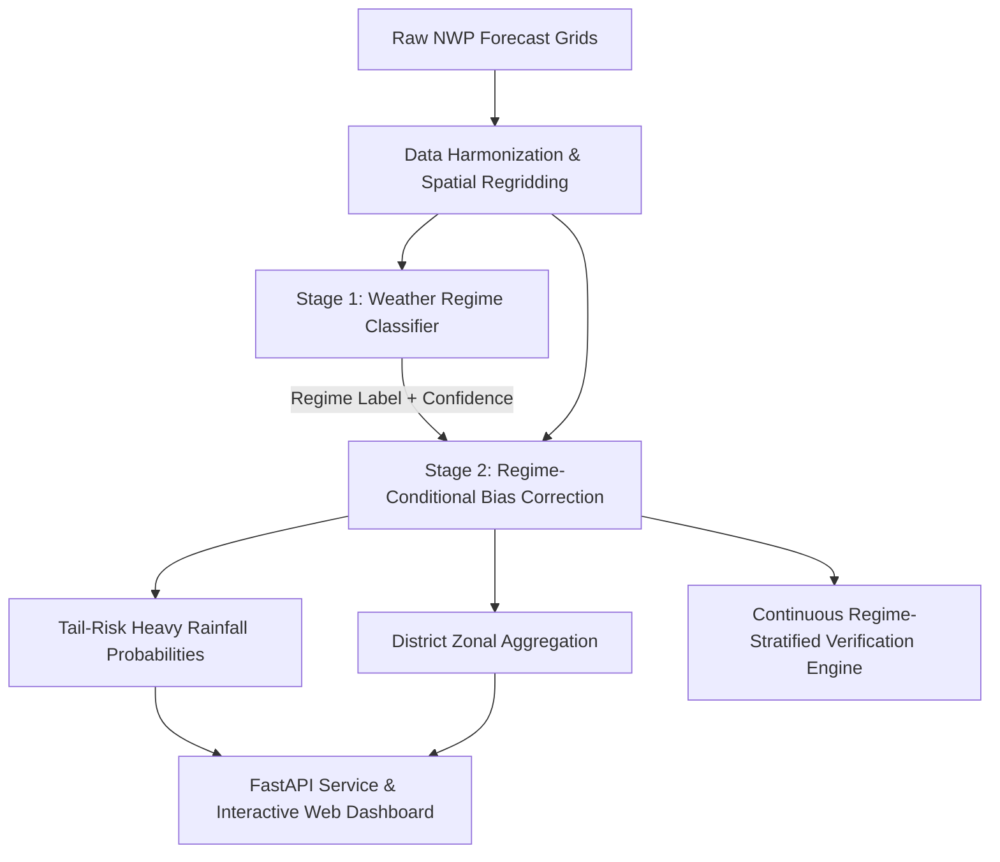

# RituGyan (ऋतु + ज्ञान)

### Regime-Aware AI Post-Processing of Monsoon Rainfall Forecasts

RituGyan is an AI/ML-based meteorological post-processing system that enhances the accuracy of monsoon rainfall forecasts across India by identifying the prevailing **weather regime** (*Active Monsoon, Break Monsoon, Monsoon Low/Depression, Orographic, Coastal, Western Disturbance*) and applying tailored bias-correction and heavy-rainfall exceedance probability estimation.

---

## 📚 Project Documentation

The complete architectural, product, and implementation specifications are available in the [`docs/`](file:///c:/Users/biswa/OneDrive/Documents/GitHub/RituGyan/docs) directory:

1. **[Product Requirements Document (PRD)](file:///c:/Users/biswa/OneDrive/Documents/GitHub/RituGyan/docs/RituGyan_PRD.md)**
   - Problem statement, user personas, market gap analysis, feature requirements, and success metrics.

2. **[Technical Approach](file:///c:/Users/biswa/OneDrive/Documents/GitHub/RituGyan/docs/RituGyan_Technical_Approach.md)**
   - Conceptual two-stage ML methodology, data requirements, and metric definitions.

3. **[Technical Architecture](file:///c:/Users/biswa/OneDrive/Documents/GitHub/RituGyan/docs/RituGyan_Technical_Architecture.md)**
   - C4 architecture diagrams, data ingestion & regridding engine, Stage 1 regime classification, Stage 2 regime-conditional ML correction, verification engine, FastAPI endpoints, and deployment topology.

4. **[Phase-Wise Implementation Plan](file:///c:/Users/biswa/OneDrive/Documents/GitHub/RituGyan/docs/RituGyan_Implementation_Plan.md)**
   - Step-by-step 8-phase execution roadmap from environment setup and feature engineering to verification scorecards, API serving, and the interactive web dashboard.

---

## 🛠️ High-Level System Workflow

