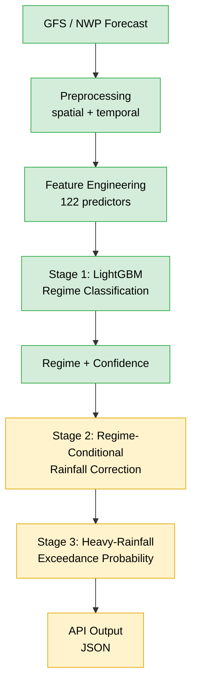

# RituGyan

**Regime-Aware AI Post-Processing of Monsoon Rainfall Forecasts**

> Rainfall forecast errors are not the same in every weather situation. RituGyan **identifies the prevailing monsoon regime first**, then uses it to make NWP rainfall corrections context-aware, with a focus on **heavy and extreme rainfall**.

---

## Contents

[Problem](#problem) · [Idea](#core-idea) · [Pipeline](#pipeline) · [Stage 1 Model](#stage-1-weather-regime-classifier) · [Heavy Rainfall](#heavy-rainfall-focus) · [Results](#results) · [Quick Start](#quick-start-backend-only) · [Status](#project-status) · [Limitations](#limitations) · [Roadmap](#roadmap)

---

## Problem

NWP precipitation forecasts carry systematic biases, and those biases **change with the weather regime**.

- One universal correction doesn't fit every situation (active vs. break monsoon, depression, coastal, orographic).
- Heavy and extreme rainfall is hard to forecast and rare in training data.
- A single rainfall number hides uncertainty.
- It's hard to explain *why* a forecast was corrected.

## Core Idea

| Conventional | RituGyan |
|---|---|
| Forecast → one general correction → final rainfall | Forecast + atmosphere → **weather regime** → **regime-specific correction** → corrected rainfall + **exceedance probabilities** |

---

## Pipeline


<details>
<summary>Text version of the pipeline (with implementation status)</summary>



🟩 Implemented  🟨 In progress / planned

</details>

> The current system is **backend/API only**. There is no UI/UX layer yet.

---

## Stage 1: Weather-Regime Classifier

Multiclass **LightGBM** model on **122 GFS-derived predictors** (precipitation, pressure, temperature, dew point, wind, moisture, spatial rainfall patterns, synoptic conditions).

| Regime | Description |
|---|---|
| 🌧️ Active Monsoon | Stronger, widespread monsoon activity |
| ☁️ Break Monsoon | Reduced monsoon rainfall |
| 🌀 Monsoon Depression | Organized synoptic system with rainfall |
| ⛰️ Orographic Monsoon | Terrain-driven rainfall |
| 🌊 Coastal Regime | Coastal atmospheric conditions |

> *Western Disturbance* is kept in the research labels but excluded from the 5-class model: too few samples for reliable held-out evaluation.

---

## Heavy-Rainfall Focus

RituGyan targets high-impact events using IMD-style thresholds and will output **probability of exceedance**, not just one number.

| Category | Threshold |
|---|---:|
| Heavy | ≥ 64.5 mm/day |
| Very Heavy | ≥ 115.6 mm/day |
| Extremely Heavy | ≥ 204.5 mm/day |

---

## Results

Chronological split, **2024 held-out test** (Stage 1 research baseline):

| Metric | Result |
|---|---:|
| Accuracy | ~82.0% |
| Balanced Accuracy | ~60.5% |
| Macro F1 | ~0.600 |

⚠️ These are **baseline** numbers. Some regimes have few samples, so balanced accuracy and macro F1 are the more honest indicators. The model will be **retrained and revalidated on operational GFS-only predictors** before any operational performance claim.

---

## API

FastAPI backend with health check, model loading, input validation, regime prediction, class probabilities, and model/feature-source metadata.

```json
{
  "date": "2024-09-15",
  "predicted_regime": "MONSOON_DEPRESSION",
  "confidence": 0.7657,
  "probabilities": {
    "ACTIVE_MONSOON": 0.0375,
    "BREAK_MONSOON": 0.1258,
    "MONSOON_DEPRESSION": 0.7657,
    "OROGRAPHIC_MONSOON": 0.0354,
    "COASTAL_REGIME": 0.0355
  },
  "model_version": "stage1_lightgbm_5class_operational_gfs_v1"
}
```

> Inference currently runs on **historical dates in the feature store**. Live GFS ingestion is not yet built.

---

## Quick Start (backend only)

```bash
# run the API
uvicorn main:app --reload

# run tests
pytest
```

- API: http://127.0.0.1:8000
- Interactive docs: http://127.0.0.1:8000/api/v1/docs

### Reviewer guide (SIH judges)

1. Read this README (problem, solution, architecture)
2. Inspect Stage 1 artifacts: `train_stage1_operational_gfs.py`, `evaluation_report.md`, `baseline_comparison.json`
3. Inspect the feature pipeline in `src/features/`
4. Run the API and test the prediction endpoint
5. Check the roadmap below (implemented vs. planned components)

---

## Repository Structure

```text
RituGyan/
├── data/                  # raw / processed / shapefiles
├── models/                # trained artifacts + metadata
├── src/
│   ├── ingestion/
│   └── features/
├── configs/
├── reports/
├── tests/
├── main.py                # FastAPI app
├── stage1.py
├── stage1_service.py
├── train_stage1_operational_gfs.py
├── evaluation_report.md
├── baseline_comparison.json
└── README.md
```

---

## Project Status

| Component | Status |
|---|---|
| Data preprocessing & feature engineering | ✅ Implemented |
| Stage 1 regime classifier (LightGBM) | ✅ Implemented |
| 122-feature operational GFS pipeline | ✅ Implemented |
| FastAPI backend + tests | ✅ Implemented |
| Operational GFS model retraining & validation | 🔄 In progress |
| Regime-conditional rainfall correction | 🔄 Next |
| Heavy-rainfall probability model | 📋 Planned |
| End-to-end verification | 📋 Planned |
| Live ingestion / production deployment | 🎯 Future |

**Not claimed yet:** a UI/dashboard, live forecasting, production deployment, independent meteorological validation, final correction or heavy-rainfall probability skill.

---

## Verification Plan

| Task | Metrics |
|---|---|
| Regime classification | Accuracy, Balanced Accuracy, Precision, Recall, Macro F1, Weighted F1 |
| Rainfall post-processing | RMSE, MAE, Bias, ETS, CSI, POD, FAR, FSS |

All scores will also be reported **regime by regime**, not just overall.

---

## Limitations

- Regime classes are imbalanced; some have limited samples.
- Extreme rainfall events are rare.
- Predictions currently use historical feature-store dates only.
- Research baseline and operational GFS pipeline are separate configurations.
- Correction and heavy-rainfall stages are not yet built or validated.
- Needs further meteorological validation before operational use.

---

## Roadmap

1. Data + validation ✅
2. Feature engineering ✅
3. Weather-regime classification ✅
4. Operational GFS pipeline ✅
5. Regime-conditional correction 🔄
6. Heavy-rainfall probability
7. Verification
8. End-to-end prototype demo

---

## Applications

🚨 **Disaster management** (heavy-rainfall preparedness) · 🌾 **Agriculture** · 💧 **Water resources** · 🌦️ **Forecasting support** · 🔬 **Research** (regime-wise error analysis)

---

### Built for Smart India Hackathon

**RituGyan:** understand the weather regime first, then decide how the rainfall forecast should be corrected.
