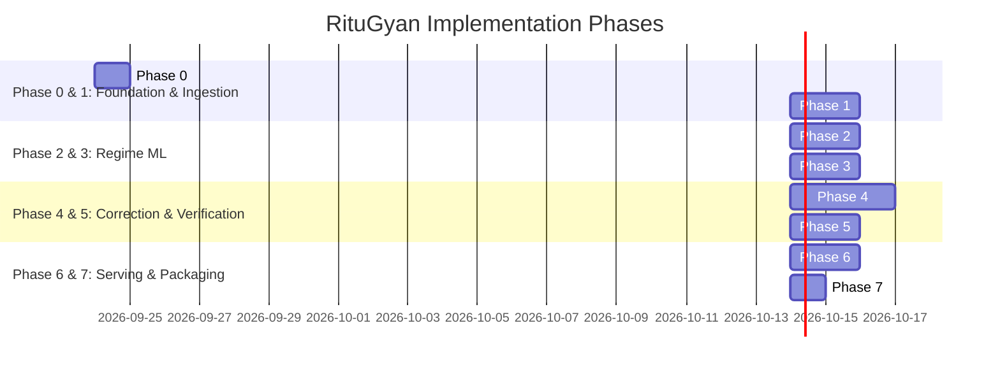

# Implementation Plan: Phase-Wise Development for RituGyan

## RituGyan — Regime-Aware AI Post-Processing of Monsoon Rainfall Forecasts

**Document Version:** 1.0  
**Status:** Approved Roadmap  
**Companions:** [RituGyan_PRD.md](file:///c:/Users/biswa/OneDrive/Documents/GitHub/RituGyan/docs/RituGyan_PRD.md), [RituGyan_Technical_Architecture.md](file:///c:/Users/biswa/OneDrive/Documents/GitHub/RituGyan/docs/RituGyan_Technical_Architecture.md), [RituGyan_Phase_Requirements_and_External_Dependencies.md](file:///c:/Users/biswa/OneDrive/Documents/GitHub/RituGyan/docs/RituGyan_Phase_Requirements_and_External_Dependencies.md)

---

## 1. Executive Summary & Delivery Strategy

This document outlines the **phased technical roadmap** for implementing RituGyan from repository initialization to an operational prototype. The implementation follows an **incremental, verification-driven approach**:
- First delivering a reliable baseline (Empirical Quantile Mapping per regime),
- Followed by the advanced machine learning models (LightGBM/XGBoost residual regressor with regime conditioning and tail-risk classifiers),
- Grounded by a continuous, regime-stratified verification and scoring engine,
- Delivered via a modern FastAPI serving service and an interactive Web operational dashboard (HTML/CSS/JS or React).

---

## 2. Phase-by-Phase Implementation Plan

### Phase 0: Foundation, Tooling & Environment Setup
- **Objective:** Establish repo structure, dependency lockfiles, and centralized configuration.
- **Deliverables:**
  - Standardized directory layout (`src/ingestion`, `src/features`, `src/models`, `src/evaluation`, `src/api`, `src/ui`, `configs`, `tests`).
  - Dependencies installed (`xarray`, `netCDF4`, `cfgrib`, `xesmf`, `geopandas`, `LightGBM`, `XGBoost`, `scikit-learn`, `xskillscore`, `pysteps`, `FastAPI`, `uvicorn`).
  - `configs/default_config.yaml` specifying Indian geographic bounding box (`6.0°N to 38.0°N`, `68.0°E to 98.0°E`), grid resolution (`0.25°`), IMD threshold definitions, and file paths.

---

### Phase 1: Data Ingestion, Geospatial Alignment & Feature Store
- **Objective:** Build ingestion connectors and spatial-temporal harmonization pipelines.
- **Deliverables:**
  - **NWP & Observation Ingestors (`src/ingestion/`):** Ingestion pipelines for raw forecast datasets (ERA5/GFS) and ground truth (IMD gridded / IMERG).
  - **Spatial Regridding Engine (`src/ingestion/regridder.py`):** Conservative regridding for precipitation flux and bilinear interpolation for atmospheric fields onto a regular 0.25° grid over India.
  - **Temporal Alignment:** 24-hour accumulation window mapping to 08:30 IST (03:00 UTC).
  - **Static Topography & Mask Layer (`src/features/static_features.py`):** SRTM DEM (elevation, slope, aspect), distance-to-coast raster, and Indian district polygon shapefiles.
  - **Storage:** Persisted multi-dimensional `Zarr` stores and tabular `Parquet` feature tables.

---

### Phase 2: Synoptic Feature Engineering & Historical Regime Labeling
- **Objective:** Extract atmospheric predictors and construct labeled training datasets.
- **Deliverables:**
  - **Automated Historical Regime Labeler (`src/features/regime_labeler.py`):** Programmatically label historical days using IMD meteorological criteria:
    - *Active Monsoon:* Low-level jet at 850 hPa > 30 knots, negative OLR anomalies over Central India, monsoon trough south of normal.
    - *Break Monsoon:* Trough shifted to Himalayan foothills, positive OLR anomaly over Central India.
    - *Monsoon Low / Depression:* Closed cyclonic circulation, pressure departure < -2 hPa, RSMC tracked events.
    - *Western Disturbance:* Upper-tropospheric westerly trough over Northwest India.
    - *Orographic & Coastal:* Static spatial feature combination with moisture flux.
  - **Feature Extraction Engine (`src/features/synoptic_indices.py`):**
    - Monsoon Trough Index, 850 hPa / 200 hPa vertical wind shear, and relative vorticity.
    - Moisture flux divergence and Total Column Water Vapour (TCWV) anomalies.
    - Antecedent 3-day / 7-day rainfall departure from normal climatology.
  - **Data Partitioning:** Split data strictly by monsoon season (e.g., train on 2018–2022, test on 2023–2024) to eliminate temporal data leakage.

---

### Phase 3: Stage 1 — Weather Regime Classification Engine
- **Objective:** Train and deploy the multi-class regime classifier.
- **Deliverables:**
  - **Stage 1 ML Classifier (`src/models/stage1_regime/classifier.py`):** LightGBM/XGBoost multi-class classifier with class-balanced weighting for rare events (monsoon depressions).
  - **Diagnostic Report:** Confusion matrix, per-regime Precision/Recall/F1 scores, and SHAP feature attribution.
  - **Inference Module:** Clean API returning predicted regime name, primary confidence score, and posterior probability distribution vector across all 6 regime classes.

---

### Phase 4: Stage 2 — Regime-Conditional Bias Correction & Tail Risk Engine
- **Objective:** Build the two-tier bias correction models and probabilistic heavy rainfall classifiers.
- **Deliverables:**
  - **Tier 1 Baseline — Per-Regime Empirical Quantile Mapping (`src/models/stage2_correction/quantile_mapper.py`):** Separate empirical CDF transfer functions per regime.
  - **Tier 2 Innovation — Unified ML Residual Regressor (`src/models/stage2_correction/ml_corrector.py`):** LightGBM/XGBoost regressor modeling non-linear bias corrections using raw rainfall, regime embeddings, topography, and ambient moisture.
  - **Tail-Risk Multi-Threshold Classifiers (`src/models/stage2_correction/exceedance_classifier.py`):**
    - $P(\text{Rain} \ge 64.5\text{ mm/day})$ (Heavy)
    - $P(\text{Rain} \ge 115.6\text{ mm/day})$ (Very Heavy)
    - $P(\text{Rain} \ge 204.5\text{ mm/day})$ (Extremely Heavy)
  - **District Zonal Aggregator (`src/models/stage2_correction/district_aggregator.py`):** Area-weighted spatial reduction to Indian district polygons, computing district mean, 90th percentile, and IMD color-coded alert levels (Green / Yellow / Orange / Red).

---

### Phase 5: Verification Engine & Scorecard Generator
- **Objective:** Implement rigorous, regime-stratified meteorological skill evaluation.
- **Deliverables:**
  - **Continuous Skill Metrics (`src/evaluation/metrics.py`):** RMSE, MAE, Mean Bias, Pearson Correlation.
  - **Categorical Tail Skill Metrics (`src/evaluation/metrics.py`):** Contingency table generation, Equitable Threat Score (ETS), Critical Success Index (CSI), Probability of Detection (POD), False Alarm Ratio (FAR).
  - **Spatial Verification (`src/evaluation/spatial_fss.py`):** Fractions Skill Score (FSS) across neighborhood scales ($n = 1, 3, 5, 9$ grid points).
  - **Scorecard Generator (`src/evaluation/scorecard.py`):** Automated generation of regime-stratified comparison tables and markdown/PDF verification reports comparing Raw NWP vs. Tier 1 EQM vs. Tier 2 ML.

---

### Phase 6: API Layer, Interactive Dashboard & Fallback Mechanisms
- **Objective:** Deploy the serving API, interactive user dashboard, and fault-tolerance mechanisms.
- **Deliverables:**
  - **FastAPI Core Service (`src/api/app.py`):**
    - `/api/v1/forecast/latest` and `/api/v1/forecast/district/{district_id}`
    - `/api/v1/regime/current` and `/api/v1/regime/diagnostics/{region_id}`
    - `/api/v1/verification/scorecard` and `/api/v1/verification/report/export`
  - **Interactive Web Portal (`src/ui/` or `frontend/`):**
    - *Forecast Explorer:* Interactive geospatial maps comparing raw vs. corrected rainfall, district zoom, and heavy rainfall exceedance heatmaps.
    - *Regime Inspector:* Live regime classification display, synoptic index gauges, and feature anomaly maps.
    - *Verification Center:* Regime-stratified scorecards, ETS/RMSE comparison charts, and FSS spatial curves.
  - **Resilience & Fallback Engine:** Automatic graceful degradation to EQM / climatology when synoptic data is unavailable or regime classification confidence $< 0.60$.

---

### Phase 7: Testing, Historical Case Studies & Submission Packaging
- **Objective:** Final testing, validation on extreme weather case studies, and documentation.
- **Deliverables:**
  - **Comprehensive Test Suite (`tests/`):** Unit and integration tests covering regridding, feature calculations, model inference, and metric calculations.
  - **Historical Case Studies:**
    - Case Study 1: Severe Monsoon Depression Flood Event (demonstrating intensity error reduction).
    - Case Study 2: Break Monsoon Drought Spell (demonstrating false-alarm suppression).
  - **Final Packaging:** `README.md`, reproduction scripts, and ready-to-run demo commands.

---

## 3. Milestone & Deliverables Checklist

| Phase | Milestone | Primary Artifacts | Status |
|---|---|---|---|
| **Phase 0** | Setup & Foundation | Directory structure, `configs/default_config.yaml`, `requirements.txt` | Planned |
| **Phase 1** | Ingestion & Alignment | `regridder.py`, `static_features.py`, Processed Zarr store | Planned |
| **Phase 2** | Synoptic Features & Labels | `regime_labeler.py`, `synoptic_indices.py`, Parquet features | Planned |
| **Phase 3** | Stage 1 Classifier | `classifier.py`, Confusion matrix, Feature importance | Planned |
| **Phase 4** | Stage 2 Bias Correction | `quantile_mapper.py`, `ml_corrector.py`, `exceedance_classifier.py` | Planned |
| **Phase 5** | Verification Engine | `metrics.py`, `spatial_fss.py`, Regime scorecard generator | Planned |
| **Phase 6** | API & Web Dashboard | `src/api/app.py`, `src/ui/`, Fallback handler | Planned |
| **Phase 7** | Testing & Case Studies | Test suite, 2 historical case study reports, Demo script | Planned |

---

*End of Implementation Plan*
