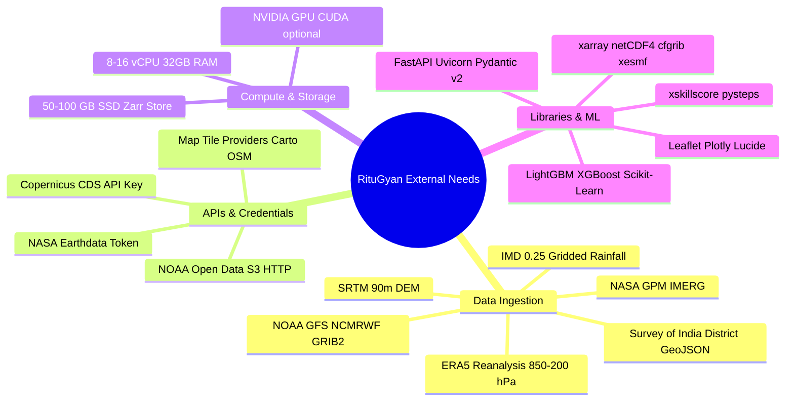

# RituGyan — Phase-Wise External Requirements & Dependencies Matrix

**Document Version:** 1.0  
**Project:** RituGyan (Regime-Aware AI Post-Processing of Monsoon Rainfall Forecasts)  
**Companions:** [RituGyan_Implementation_Plan.md](file:///c:/Users/biswa/OneDrive/Documents/GitHub/RituGyan/docs/RituGyan_Implementation_Plan.md), [RituGyan_Technical_Architecture.md](file:///c:/Users/biswa/OneDrive/Documents/GitHub/RituGyan/docs/RituGyan_Technical_Architecture.md), [RituGyan_PRD.md](file:///c:/Users/biswa/OneDrive/Documents/GitHub/RituGyan/docs/RituGyan_PRD.md)

---

## 1. Executive Overview

This document provides a **phase-by-phase breakdown of all external dependencies, datasets, APIs, authentication credentials, pre-trained components, compute resources, and third-party tools** required to build, train, evaluate, and serve the RituGyan platform.



---

## 2. Summary Matrix: Phase vs. External Requirements

| Phase | Core Objective | External Datasets & Sources | APIs & Auth Credentials | Key Python / Tool Dependencies | Compute & Storage Required |
|---|---|---|---|---|---|
| **Phase 0: Foundation & Setup** | Project structure, environment & config | Synthetic dummy grids for dry-run tests | None | `conda` / `pip`, `git`, `eccodes`, `GDAL`, `PROJ` | 4 vCPU, 8 GB RAM, ~5 GB Disk |
| **Phase 1: Ingestion & Alignment** | NWP/Obs ingestion, regridding & static features | • IMD Gridded Rainfall (0.25°)<br>• ERA5 Reanalysis<br>• GFS / NCMRWF Forecasts<br>• NASA GPM IMERG<br>• SRTM 90m DEM<br>• India District Shapefiles | • Copernicus CDS API (`~/.cdsapirc`)<br>• NASA Earthdata Login (`~/.netrc`)<br>• NOAA NOMADS / AWS S3 Open Data | `xarray`, `netCDF4`, `cfgrib`, `xesmf`, `geopandas`, `shapely`, `rasterio`, `dask`, `zarr` | 8–16 vCPU, 32 GB RAM, 50–100 GB SSD Storage |
| **Phase 2: Synoptic Features & Labels** | Synoptic index extraction & regime labeling | • NOAA OLR (Daily Interpolated)<br>• RSMC New Delhi Cyclone / Depression Bulletins<br>• Historical Monsoon Onset/Break Catalogs | • NOAA PSL HTTP endpoint<br>• RSMC / IMD Bulletin Archive | `scipy`, `pandas`, `pyarrow`, `numpy`, `scikit-learn` | 8 vCPU, 16–32 GB RAM, 10 GB Parquet Store |
| **Phase 3: Stage 1 Regime Classifier** | Multi-class weather regime classifier | • Labeled synoptic tabular features (2018–2024)<br>• IMD Verification Reports | • MLflow Tracking Server (local/remote) | `lightgbm`, `xgboost`, `scikit-learn`, `optuna`, `shap`, `joblib` | 8 vCPU, NVIDIA GPU (optional for tuning), 5 GB Disk |
| **Phase 4: Stage 2 Bias Correction** | EQM baseline, ML residual regressor & tail classifiers | • Matched NWP-Observation pairs<br>• Processed DEM slope/aspect & distance-to-coast rasters | • None (uses local Feature Store) | `lightgbm`, `xgboost`, `scipy.stats`, `scikit-learn`, `geopandas` | 8–16 vCPU, 32 GB RAM, GPU (optional), 15 GB Model Artifacts |
| **Phase 5: Verification Engine** | Continuous, categorical, spatial & regime metrics | • Test-split observations (Monsoon 2023–2024)<br>• Climatological baseline tables | • None | `xskillscore`, `pysteps`, `matplotlib`, `seaborn`, `weasyprint` / `reportlab` | 8 vCPU, 16 GB RAM, 5 GB Disk |
| **Phase 6: API & Web Dashboard** | REST API service & interactive portal | • Real-time / Daily NWP ingest feeds<br>• Processed district polygons GeoJSON | • CartoDB / OpenStreetMap tile servers<br>• Optional Mapbox / Stadia API token | `fastapi`, `uvicorn`, `pydantic`, `httpx`, `leaflet.js`, `plotly.js`, `lucide` | 2–4 vCPU, 8 GB RAM, 100 Mbps Network |
| **Phase 7: Testing & Packaging** | End-to-end tests, case studies & Docker container | • Extreme event archives (July 2023 North India floods, Aug 2023 Break Monsoon) | • Docker Hub / Container Registry (optional) | `pytest`, `pytest-cov`, `pytest-asyncio`, `docker`, `docker-compose` | Standard Workstation / CI Runner |

---

## 3. Deep-Dive: Phase-by-Phase Requirements

---

### Phase 0: Foundation, Tooling & Environment Setup

#### 1. System Dependencies (C/C++ Geospatial Libraries)
Before installing Python packages, the host OS (Linux / Windows WSL / macOS) requires binary geospatial engines:
- **`eccodes`**: ECMWF library for decoding GRIB1 and GRIB2 meteorological formats.
- **`GDAL` / `GEOS` / `PROJ`**: Underlying libraries for `geopandas`, `rasterio`, and `shapely`.
- **Conda / Mamba** (recommended) or `pip` with pre-compiled wheels.

#### 2. Configuration & Manifest Assets
- `configs/default_config.yaml`: Bounding box (`6.0°N to 38.0°N`, `68.0°E to 98.0°E`), target grid spacing (`0.25°`), IMD threshold definitions (`64.5`, `115.6`, `204.5` mm/day).
- Local folder structure: `data/raw`, `data/processed`, `data/shapefiles`, `data/static`, `models/weights`.

---

### Phase 1: Data Ingestion, Geospatial Alignment & Feature Store

#### 1. External Datasets & Feeds

| Dataset Name | Source / Provider | Spatial Coverage / Resolution | Temporal Frequency | Format | Purpose in RituGyan |
|---|---|---|---|---|---|
| **IMD Daily Gridded Rainfall** | India Meteorological Department (IMD) / CDAC | All India ($6.5^\circ\text{N} - 38.5^\circ\text{N}$, $66.5^\circ\text{E} - 100^\circ\text{E}$), $0.25^\circ \times 0.25^\circ$ | Daily (08:30 IST / 03:00 UTC) | Binary / NetCDF4 | **Ground-truth target** for ML bias correction and verification |
| **ERA5 Reanalysis** | ECMWF / Copernicus Climate Data Store (CDS) | Global / $0.25^\circ \times 0.25^\circ$ | Hourly / Daily (single & pressure levels: 850, 700, 500, 200 hPa) | NetCDF4 / GRIB2 | Synoptic feature extraction ($u, v$, geopotential, specific humidity, TCWV, MSLP) |
| **NOAA GFS / NCMRWF Unified Model** | NOAA NOMADS / NCMRWF Open Data | Global / $0.25^\circ$ ($0.12^\circ$ for NCMRWF NCUM) | Daily 00Z / 12Z runs, 24h accumulated precipitation | GRIB2 | **Input raw forecast** that requires post-processing |
| **NASA GPM IMERG Final Run** | NASA GES DISC / Earthdata | Global $60^\circ\text{N}-60^\circ\text{S}$, $0.1^\circ \times 0.1^\circ$ | Daily accumulation (V07) | HDF5 / NetCDF4 | Supplementary high-res satellite rainfall benchmark & cross-validation |
| **SRTM Digital Elevation Model (DEM)** | NASA / USGS / AWS Open Data | India domain, 90m (resampled to $0.25^\circ$) | Static | GeoTIFF | Elevation, terrain slope, aspect, orographic lift covariates |
| **India District Shapefiles** | Survey of India / Datameet Community GIS | 700+ Indian district polygons | Static | GeoJSON / ESRI Shapefile | District-level spatial masking and zonal aggregation |

#### 2. External APIs & Authentication Setup
1. **Copernicus CDS API (for ERA5 downloads):**
   - Registration: [cds.climate.copernicus.eu](https://cds.climate.copernicus.eu/)
   - Config file: `~/.cdsapirc`
   - Content:
     ```ini
     url: https://cds.climate.copernicus.eu/api
     key: <YOUR-PERSONAL-CDS-API-KEY>
     ```
2. **NASA Earthdata Login (for IMERG downloads):**
   - Registration: [urs.earthdata.nasa.gov](https://urs.earthdata.nasa.gov/)
   - Config file: `~/.netrc`
3. **NOAA NOMADS / AWS S3 Open Data (for GFS GRIB2 files):**
   - Public S3 bucket: `s3://noaa-gfs-bdp-pds/` (No authentication required).

#### 3. Storage & I/O Footprint
- Raw downloads: ~30–50 GB (5 monsoon seasons 2018–2022 + test 2023–2024).
- Harmonized Zarr store: ~15–20 GB compressed multi-dimensional cubes.

---

### Phase 2: Synoptic Feature Engineering & Historical Regime Labeling

#### 1. External Datasets & Climatological Catalogs
- **NOAA Interpolated OLR (Outgoing Longwave Radiation):** Daily mean $2.5^\circ$ grid (NOAA Physical Sciences Laboratory) to compute Central India convective anomalies.
- **RSMC New Delhi Tropical Cyclone & Low Pressure System Atlas:** Historical tracks of monsoon depressions and deep depressions (1990–2024).
- **Monsoon Trough Position Climatology:** IMD standard monsoon trough normal line coordinates.
- **IMD Onset / Advance / Break Climatological Dates:** Standard meteorological definitions from IMD Monograph / Pai et al.

#### 2. Computed Synoptic Indicators
- **Monsoon Trough Index (MTI):** MSLP anomaly difference between Northern Plains and Central India.
- **Low-Level Jet Strength (LLJ):** 850 hPa zonal wind over Arabian Sea & Peninsular India ($5^\circ\text{N}-15^\circ\text{N}, 60^\circ\text{E}-80^\circ\text{E}$).
- **Moisture Flux Divergence:** $\nabla \cdot (\mathbf{v} q)$ integrated across 1000–700 hPa.
- **Vertical Wind Shear:** $|\mathbf{v}_{200} - \mathbf{v}_{850}|$ (identifies active convective shear zones).

---

### Phase 3: Stage 1 — Weather Regime Classification Engine

#### 1. Training Data & Label Matrices
- Tabular feature store (`.parquet`) containing:
  - 6 Regime target classes: `ACTIVE_MONSOON`, `BREAK_MONSOON`, `DEPRESSION_LOW`, `OROGRAPHIC_MONSOON`, `COASTAL_REGIME`, `WESTERN_DISTURBANCE`.
  - Class distribution balance weights (handling rare depression/cyclonic events).

#### 2. ML Libraries & Artifact Storage
- `lightgbm` / `xgboost` / `scikit-learn` for multi-class classification.
- `shap` for feature attribution and diagnostic plots.
- `mlflow` for logging run parameters, confusion matrices, and model artifact registry (`models/weights/stage1_regime.joblib`).

---

### Phase 4: Stage 2 — Regime-Conditional Bias Correction & Tail Risk Engine

#### 1. Machine Learning Engines & Algorithms
- **Tier 1 Baseline:** Empirical Quantile Mapping (EQM) per regime using `scipy.stats.ecdf`.
- **Tier 2 Residual Corrector:** LightGBM / XGBoost Regressor predicting additive/multiplicative precipitation corrections ($y_{\text{corrected}} = x_{\text{raw}} + \hat{\Delta}$).
- **Tier 2 Probabilistic Classifiers:** 3 dedicated binary gradient boosting heads for IMD extreme thresholds:
  1. $P(\text{Rain} \ge 64.5\text{ mm/day})$ (Heavy)
  2. $P(\text{Rain} \ge 115.6\text{ mm/day})$ (Very Heavy)
  3. $P(\text{Rain} \ge 204.5\text{ mm/day})$ (Extremely Heavy)

#### 2. District Aggregation Layer
- Vector spatial join using `geopandas` and `shapely.strtree` between the regular $0.25^\circ$ prediction grid and the 700+ Indian district polygons.
- Area-weighted average, maximum, and 90th-percentile rainfall calculation.

---

### Phase 5: Meteorological Verification Engine & Scorecards

#### 1. External Evaluation Toolkits
- **`xskillscore`**: Computation of gridded RMSE, MAE, Pearson correlation, Mean Bias.
- **`pysteps` (Verification module)**: Fractions Skill Score (FSS) calculation across spatial scales ($n = 1, 3, 5, 9$ grid squares) to bypass point-by-point double-penalty errors.
- **Categorical Metrics Engine**: Contingency tables computing Equitable Threat Score (ETS), Critical Success Index (CSI), Probability of Detection (POD), False Alarm Ratio (FAR).

#### 2. Reporting Libraries
- `matplotlib` & `seaborn` for automated generation of scorecard figures (ROC curves, Reliability diagrams, Taylor diagrams).
- `weasyprint` / `reportlab` or Markdown generation for exportable PDF verification scorecards.

---

### Phase 6: API Layer, Interactive Web Portal & Resilience

#### 1. Serving & API Architecture
- **`FastAPI` + `Uvicorn`**: Asynchronous REST API serving GeoJSON district forecasts, grid rasters, and verification reports.
- **`Pydantic v2`**: Strict payload data validation and contract enforcement.

#### 2. Frontend / Dashboard Assets
- **Web Portal Stack**: HTML5 / CSS3 (glassmorphic dark UI) + Vanilla JavaScript (or React).
- **Map & Visualization Libraries**:
  - `Leaflet.js` / `MapLibre GL JS` for interactive multi-layer map rendering.
  - `Plotly.js` for interactive regime timeseries, threshold exceedance probability gauges, and scorecard graphs.
  - `Lucide Icons` for operational UI iconography.
- **Map Tile Providers (External CDN / Tiles)**:
  - OpenStreetMap standard / CartoDB Dark Matter tiles: `https://{s}.basemaps.cartocdn.com/dark_all/{z}/{x}/{y}{r}.png` (Free, public, no key needed for moderate loads).
  - Optional: Mapbox / Stadia Maps API Key (if satellite basemaps are desired).

---

### Phase 7: Testing, Historical Case Studies & Submission Packaging

#### 1. Historical Validation Case Study Datasets
1. **Case Study 1: July 2023 North India / Himachal Pradesh Floods**
   - High-impact orographic + Western Disturbance interaction event.
   - Raw NWP showed severe underprediction; benchmark RituGyan's tail-risk exceedance alert.
2. **Case Study 2: August 2023 All-India Prolonged Break Monsoon Spell**
   - False alarm suppression test over Central India agricultural zones.
3. **Case Study 3: Cyclone Biparjoy (June 2023 Landfall over Saurashtra/Kutch)**
   - Extreme precipitation placement and spatial FSS validation.

#### 2. Packaging & Delivery
- **Docker & Docker Compose**: Multi-container setup (`backend-api`, `frontend-dashboard`, `mlflow-server`).
- **Demo Script**: Automated dry-run pipeline generating synthetic/sample forecast outputs in under 60 seconds without requiring full external data download.

---

## 4. API Keys & Credentials Setup Checklist

| Service / Source | Key / Token Type | Environment Variable | Required For | Cost / Access Tier |
|---|---|---|---|---|
| **Copernicus CDS** | Personal API Key | `CDSAPI_KEY`, `CDSAPI_URL` | Downloading ERA5 atmospheric reanalysis | Free (Academic / Open) |
| **NASA Earthdata** | Bearer Token / Netrc | `EARTHDATA_USER`, `EARTHDATA_PASS` | Downloading GPM IMERG precipitation | Free (Open Access) |
| **NOAA NOMADS** | None (Public S3 / HTTPS) | `NOAA_S3_ENDPOINT` | Ingesting daily GFS forecasts | Free (Public Domain) |
| **Map Tile Provider** | CartoDB / OSM (Open) | Optional `MAPBOX_TOKEN` | Dashboard interactive basemap layers | Free |
| **MLflow Registry** | Local / SQLite / S3 | `MLFLOW_TRACKING_URI` | Model lineage and metric logging | Free (Self-hosted) |

---

## 5. Offline & Development Mode (Fallback Mock Data Generator)

To ensure smooth development and evaluation when external APIs (like CDS or NASA) have queuing delays or rate limits:
- A **Synthetic NWP & Synoptic Generator** (`src/ingestion/synthetic_generator.py`) generates realistic $0.25^\circ$ spatial NetCDF and GRIB2 grids over the Indian domain with authentic meteorological patterns (monsoon trough dip, Western Ghats orographic gradient, cyclonic vortices).
- Pre-packaged **Sample India District GeoJSON** (`data/shapefiles/india_districts.geojson`) is bundled directly in the repository.

---

*End of Requirements Matrix*
