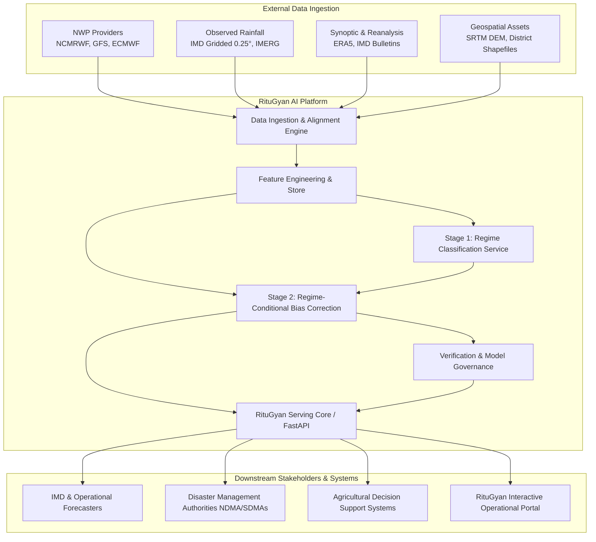
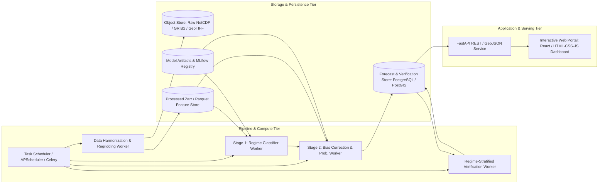
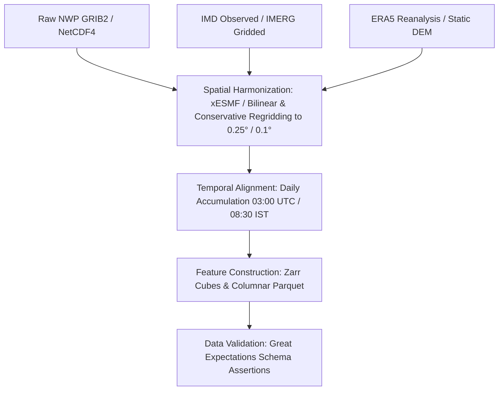
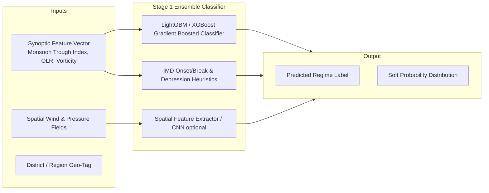
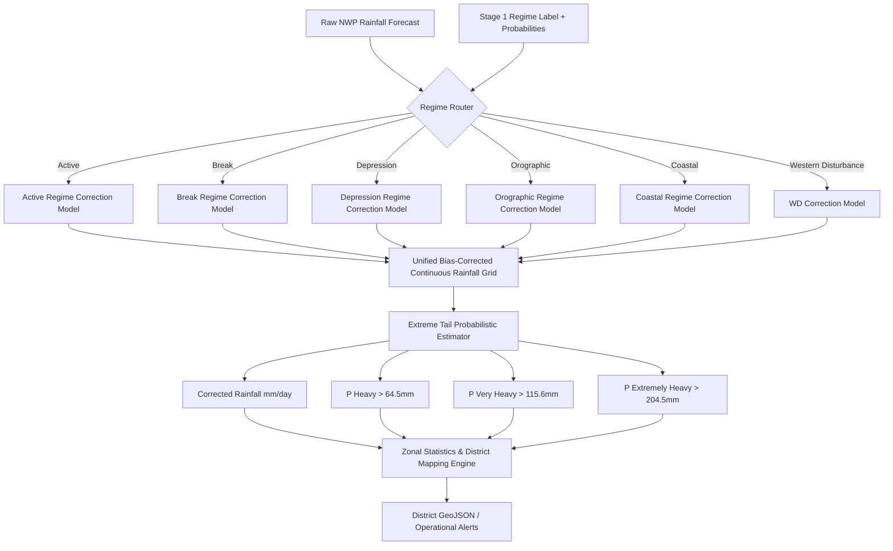
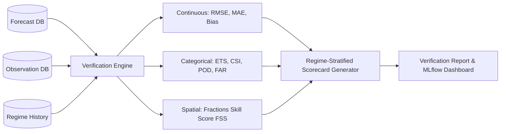
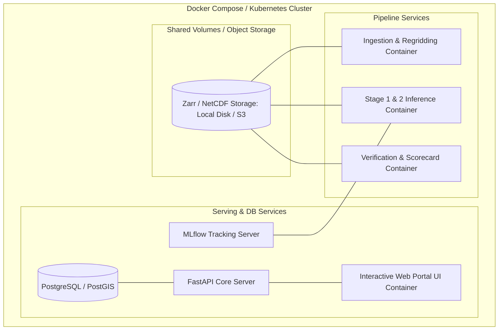
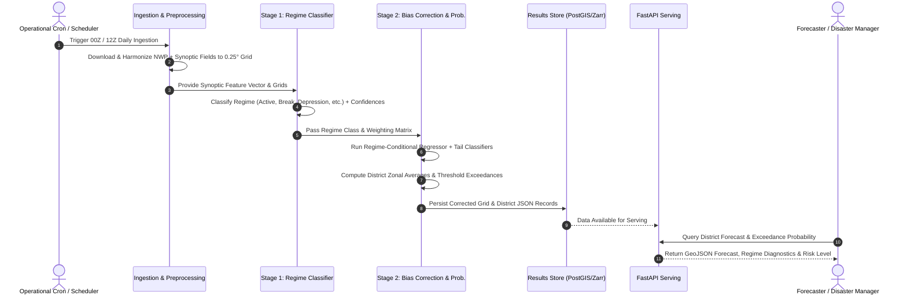
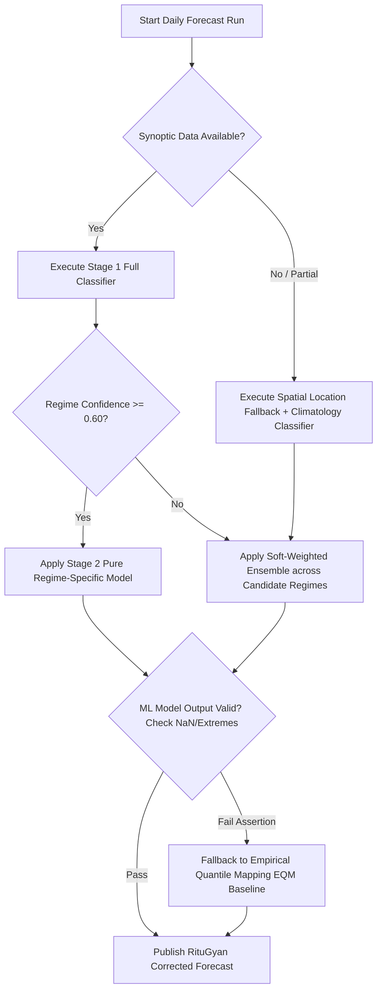

# Technical Architecture Document

## RituGyan — Regime-Aware AI Post-Processing of Monsoon Rainfall Forecasts

**Document Version:** 1.0  
**Status:** Approved Architecture Blueprint  
**Companions:** [RituGyan_PRD.md](file:///c:/Users/biswa/OneDrive/Documents/GitHub/RituGyan/docs/RituGyan_PRD.md), [RituGyan_Implementation_Plan.md](file:///c:/Users/biswa/OneDrive/Documents/GitHub/RituGyan/docs/RituGyan_Implementation_Plan.md), [RituGyan_Phase_Requirements_and_External_Dependencies.md](file:///c:/Users/biswa/OneDrive/Documents/GitHub/RituGyan/docs/RituGyan_Phase_Requirements_and_External_Dependencies.md)

---

## 1. Architecture Overview & Design Principles

### 1.1 Executive Summary
RituGyan is an operational-grade, AI/ML-driven meteorological post-processing platform designed to ingest raw Numerical Weather Prediction (NWP) forecasts, identify synoptic and local weather regimes across the Indian subcontinent, and apply regime-conditional bias correction and tail-risk probability estimators at high spatial resolution (grid and district level).

### 1.2 Core Architectural Principles
1. **Regime Conditioning over Static Global Correction:** Decouple correction algorithms based on meteorological dynamics (e.g., Depression vs. Break Monsoon) rather than applying a single blended statistical model.
2. **Tail-Risk Optimization:** Explicitly optimize for extreme precipitation events (>64.5 mm/day, >115.6 mm/day, >204.5 mm/day) rather than standard RMSE-only skill scores that wash out tail events.
3. **Decoupled, Modular Pipeline:** Ingestion, feature store, classification, correction, verification, and presentation layers operate as isolated, testable, and maintainable services.
4. **Resilience & Graceful Degradation:** The pipeline implements automatic fallback strategies (e.g., if regime classification confidence is low or auxiliary synoptic data fails, the system safely falls back to standard Empirical Quantile Mapping or raw NWP with clear diagnostic flags).
5. **Transparent, Regime-Stratified Verification:** Continuous scoring engine computes contingency tables, equitable threat scores, and spatial metrics (FSS) broken down by regime.

---

## 2. High-Level Architecture (C4 Model)

### 2.1 System Context (C4 Level 1)



### 2.2 System Container Architecture (C4 Level 2)



---

## 3. Subsystem Detailed Specifications

### 3.1 Data Architecture & Ingestion Subsystem



#### Ingestion Specifications:
- **Spatial Alignment:** Standardized target regular grid over the Indian domain (`6.0°N to 38.0°N`, `68.0°E to 98.0°E`) using conservative regridding (`xesmf.Regridder(method='conservative')`) for flux/precipitation and bilinear interpolation for continuous fields (temperature, geopotential height, MSLP).
- **Temporal Harmonization:** Accumulation window standardizing all NWP model steps to match IMD's 24-hour observation cycle (03:00 UTC of Day $T$ to 03:00 UTC of Day $T+1$, corresponding to 08:30 IST).
- **Static Covariates:**
  - SRTM Digital Elevation Model (DEM) aggregated to grid scale (mean elevation, slope, aspect).
  - Distance-to-coast raster (Euclidean distance transform).
  - Land-sea mask and regional district boundaries (Survey of India / IMD shapefiles).

---

### 3.2 Feature Store & Synoptic Representation

The Feature Store generates normalized spatial tensors and tabular vector embeddings per grid point and synoptic region.

| Feature Group | Parameters | Physical Meaning / Synoptic Value |
|---|---|---|
| **Pressure Fields** | MSLP, MSLP Anomaly, Geopotential Height (500 hPa, 200 hPa) | Identifies low-pressure systems, monsoon trough position, WD troughs |
| **Wind & Vorticity** | $u, v$ components at 850 hPa & 200 hPa, Wind Shear, Relative Vorticity | Low-level jet strength, monsoon trough shear zone, tropical easterly jet |
| **Moisture & Thermodynamics** | Specific Humidity (850 hPa, 700 hPa), Total Column Water Vapour (TCWV), Moisture Flux Divergence | Moisture availability and convergence zones |
| **Convective Activity** | Outgoing Longwave Radiation (OLR), Convective Available Potential Energy (CAPE) | Deep convection and active monsoon cloud bands |
| **Climatological Anomalies** | Antecedent 3-day / 7-day rainfall departure from normal | Soil moisture feedback and memory effects |
| **Topographic / Coastal** | Elevation, Terrain Gradient, Distance to Coastline | Orographic lift triggering (Western Ghats, Northeast hills) |

---

### 3.3 Stage 1: Weather Regime Classification Engine



#### Meteorological Regimes Classification Catalog:
1. **Active Monsoon:** Strong cross-equatorial flow, low-level jet at 850 hPa > 30 knots, monsoon trough south of normal position, high OLR anomalies over central India.
2. **Break Monsoon:** Monsoon trough shifted north to Himalayan foothills, marked rainfall reduction over Central India, increased rainfall over NE India and foothills.
3. **Monsoon Low / Depression:** Closed cyclonic circulation up to mid-troposphere, pressure departure < -2 to -4 hPa, RSMC tracked low-pressure systems.
4. **Orographic Monsoon:** Heavy precipitation triggered along windward slopes (Western Ghats, Meghalaya plateau) driven by strong westerly/southwesterly moisture flux.
5. **Coastal Regime:** Strong land-sea thermal and friction contrasts along the western and eastern coastlines with localized convergence.
6. **Western Disturbance:** Mid-latitude upper-tropospheric westerly trough propagating across northwest India (prominent in transitional and pre/post-monsoon periods).

#### Classifier Data Contracts:
```python
class RegimeClassificationOutput(BaseModel):
    timestamp: datetime
    region_id: str
    predicted_regime: str  # e.g., "DEPRESSION_LOW"
    regime_confidence: float  # e.g., 0.89
    class_probabilities: Dict[str, float]
    synoptic_metrics: Dict[str, float]  # trough_index, shear_magnitude, etc.
```

---

### 3.4 Stage 2: Regime-Conditional Bias Correction & Tail-Risk Engine



#### Dual-Correction Methodology:
1. **Tier 1 (Empirical Quantile Mapping - EQM Baseline):**
   $$x_{\text{corr}} = F_{\text{obs}, r}^{-1}\left(F_{\text{nwp}, r}(x_{\text{raw}})\right)$$
   Where $F_{\text{obs}, r}$ and $F_{\text{nwp}, r}$ are the cumulative distribution functions for regime $r$.

2. **Tier 2 (Unified LightGBM / XGBoost Non-Linear Residual Regressor):**
   $$y_{\text{corr}} = x_{\text{raw}} + f_{\theta}\left(x_{\text{raw}}, r, \mathbf{z}_{\text{synoptic}}, \mathbf{z}_{\text{topo}}\right)$$
   Where $r$ is the regime embedding vector, $\mathbf{z}_{\text{synoptic}}$ represents ambient moisture/wind features, and $\mathbf{z}_{\text{topo}}$ represents elevation and slope.

3. **Multi-Threshold Tail Classification Heads:**
   Binary probability classifiers trained with focal loss / balanced class weights to predict exceedance probabilities:
   - $P(\text{Rain} \ge 64.5\text{ mm/day})$ (IMD Heavy Rainfall)
   - $P(\text{Rain} \ge 115.6\text{ mm/day})$ (IMD Very Heavy Rainfall)
   - $P(\text{Rain} \ge 204.5\text{ mm/day})$ (IMD Extremely Heavy Rainfall)

---

### 3.5 Verification & Governance Subsystem

The verification engine operates asynchronously to ingest verified ground truth once IMD daily observations are finalized, producing regime-stratified skill scores.



#### Mathematical Formulations:
- **Equitable Threat Score (ETS):**
  $$\text{ETS} = \frac{H - H_{\text{random}}}{H + M + F - H_{\text{random}}}, \quad H_{\text{random}} = \frac{(H + M)(H + F)}{N}$$
- **Fraction Skill Score (FSS):**
  $$\text{FSS}_{(n)} = 1 - \frac{\text{MSE}_{(n)}}{\text{MSE}_{(n),\text{ref}}}$$
  Evaluated across spatial neighborhood sizes ($n = 1, 3, 5, 9$ grid squares) to evaluate spatial placement skill independent of point double-penalty errors.

---

## 4. API & Interface Architecture

### 4.1 FastAPI Service Endpoints

```
/api/v1
  ├── /forecast
  │     ├── GET  /latest?date=YYYY-MM-DD
  │     ├── GET  /district/{district_id}?date=YYYY-MM-DD
  │     └── GET  /grid/geojson?date=YYYY-MM-DD&threshold=heavy
  ├── /regime
  │     ├── GET  /current
  │     ├── GET  /history?start=...&end=...
  │     └── GET  /diagnostics/{region_id}
  ├── /verification
  │     ├── GET  /scorecard?regime=all&season=2024
  │     ├── GET  /metrics/timeseries
  │     └── GET  /report/export?format=pdf|json
  └── /health
        └── GET  /status
```

### 4.2 Forecast District Output Schema

```json
{
  "forecast_date": "2026-07-15",
  "issue_time": "2026-07-15T06:00:00Z",
  "district_id": "IN-MH-PUN",
  "district_name": "Pune",
  "state": "Maharashtra",
  "detected_regime": {
    "primary": "OROGRAPHIC_MONSOON",
    "confidence": 0.92,
    "secondary_influences": ["ACTIVE_MONSOON"]
  },
  "raw_nwp_forecast_mm": 48.5,
  "ritugyan_corrected_forecast_mm": 78.2,
  "uncertainty_interval_90": [62.0, 96.5],
  "exceedance_probabilities": {
    "heavy_gt_64_5mm": 0.76,
    "very_heavy_gt_115_6mm": 0.28,
    "extremely_heavy_gt_204_5mm": 0.04
  },
  "alert_level": "ORANGE",
  "verification_baseline_skill": {
    "historical_regime_rmse_reduction_pct": 28.4
  }
}
```

---

## 5. Technology Stack & Infrastructure Topology

### 5.1 Component Tech Stack Table

| Architectural Layer | Technologies / Frameworks | Justification |
|---|---|---|
| **Data Ingestion & Grids** | `xarray`, `netCDF4`, `cfgrib`, `xesmf`, `dask` | Native multi-dimensional meteorological raster handling and out-of-core computing |
| **Geospatial & Vector Ops** | `geopandas`, `shapely`, `rasterio`, `scipy` | Zonal district masking, spatial distance computations, CRS projections |
| **ML Modeling (Stage 1 & 2)** | `LightGBM`, `XGBoost`, `scikit-learn`, `PyTorch` | State-of-the-art tabular/spatial gradient boosting, fast inference, GPU training capability |
| **Verification & Metrics** | `xskillscore`, `pysteps`, `numpy` | Standardized WMO-compliant meteorological skill evaluation and spatial neighborhood FSS |
| **Model Tracking & Registry** | `MLflow`, `DVC` | Reproducible artifact tracking, model lineage, hyperparameter tuning |
| **API & Web Service** | `FastAPI`, `Uvicorn`, `Pydantic v2` | High-performance asynchronous REST API with automatic OpenAPI documentation |
| **Storage & Caching** | `Zarr` (grids), `Parquet` (tabular), `PostgreSQL/PostGIS` (metadata/districts) | Optimized tiered storage for large multidimensional time-series and GIS queries |
| **Interactive Visualization** | `React` / `HTML5+CSS+JS`, `Plotly.js`, `Leaflet` / `MapLibre` | Rich interactive operational web dashboard for forecast maps, regime diagnostics, and scorecards |

### 5.2 Deployment & Container Topology



---

## 6. End-to-End Operational Workflow & Sequence



---

## 7. Resilience, Fallback & Quality Assurance



1. **Missing Inflow Handling:** If external synoptic indices (e.g., OLR from satellite) are delayed, the system seamlessly falls back to NWP-derived proxies (e.g., NWP simulated OLR / vertical velocity).
2. **Confidence-Weighted Soft Correction:** If Stage 1 classification confidence falls below the strict threshold ($0.60$), Stage 2 blends correction predictions weighted proportionally by the regime class posterior probabilities $\sum p_k \cdot f_k(x)$.
3. **Physical Bound Assertions:** Precipitation outputs are strictly bounded $[0, \text{max\_physical\_limit}]$ with automatic clipping and logging of anomalous values.
4. **Data Drift & Concept Drift Monitoring:** MLflow monitors regime distribution shifts over rolling 30-day windows to detect changes in NWP model versions or climate anomalies.

---

## 8. Repository Codebase Organization Blueprint

```
RituGyan/
├── data/
│   ├── raw/                  # Downloaded raw GRIB2/NetCDF files (gitignored)
│   ├── processed/            # Regridded Zarr stores and Parquet tables
│   ├── shapefiles/           # India district and basin polygon shapefiles
│   └── static/               # Topography (DEM), distance-to-coast rasters
├── docs/
│   ├── RituGyan_PRD.md
│   ├── RituGyan_Technical_Approach.md
│   └── RituGyan_Technical_Architecture.md
├── src/
│   ├── ingestion/            # NWP, observation, and synoptic downloaders & regridders
│   │   ├── nwp_ingest.py
│   │   ├── obs_ingest.py
│   │   └── regridder.py
│   ├── features/             # Synoptic index calculators and spatial feature extraction
│   │   ├── synoptic_indices.py
│   │   └── feature_pipeline.py
│   ├── models/
│   │   ├── stage1_regime/    # Classifier trainers, inference, and regime definitions
│   │   │   ├── classifier.py
│   │   │   └── regime_definitions.py
│   │   └── stage2_correction/# Regime-conditional regressors & tail risk classifiers
│   │       ├── quantile_mapper.py
│   │       ├── ml_corrector.py
│   │       └── exceedance_classifier.py
│   ├── evaluation/           # Verification engine (RMSE, ETS, CSI, POD, FAR, FSS)
│   │   ├── metrics.py
│   │   ├── spatial_fss.py
│   │   └── scorecard.py
│   ├── api/                  # FastAPI web service endpoints and schemas
│   │   ├── app.py
│   │   ├── schemas.py
│   │   └── routes/
│   └── ui/                   # Web dashboard / React portal frontend components
│       └── app.py
├── tests/                    # Unit, integration, and meteorological validation tests
├── configs/                  # YAML configurations (grid specs, model hyperparameters)
├── notebooks/                # Exploratory data analysis, case studies & verification plots
├── Dockerfile
├── docker-compose.yml
└── requirements.txt
```

---

*End of Architecture Document*
